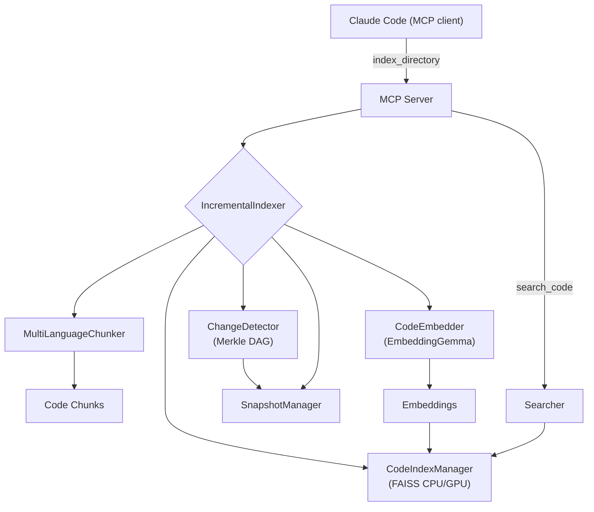

```
  ██████╗ ██╗       █████╗  ██╗   ██╗ ██████╗  ███████╗
 ██╔════╝ ██║      ██╔══██╗ ██║   ██║ ██╔══██╗ ██╔════╝
 ██║      ██║      ███████║ ██║   ██║ ██║  ██║ █████╗
 ██║      ██║      ██╔══██║ ██║   ██║ ██║  ██║ ██╔══╝
 ╚██████╗ ███████╗ ██║  ██║ ╚██████╔╝ ██████╔╝ ███████╗
  ╚═════╝ ╚══════╝ ╚═╝  ╚═╝  ╚═════╝  ╚═════╝  ╚══════╝

  ██████╗  ██████╗  ███╗   ██╗ ████████╗ ███████╗ ██╗  ██╗ ████████╗
 ██╔════╝ ██╔═══██╗ ████╗  ██║ ╚══██╔══╝ ██╔════╝ ╚██╗██╔╝ ╚══██╔══╝
 ██║      ██║   ██║ ██╔██╗ ██║    ██║    █████╗    ╚███╔╝     ██║
 ██║      ██║   ██║ ██║╚██╗██║    ██║    ██╔══╝    ██╔██╗     ██║
 ╚██████╗ ╚██████╔╝ ██║ ╚████║    ██║    ███████╗ ██╔╝ ██╗    ██║
  ╚═════╝  ╚═════╝  ╚═╝  ╚═══╝    ╚═╝    ╚══════╝ ╚═╝  ╚═╝    ╚═╝

 ██╗       ██████╗   ██████╗  █████╗  ██╗
 ██║      ██╔═══██╗ ██╔════╝ ██╔══██╗ ██║
 ██║      ██║   ██║ ██║      ███████║ ██║
 ██║      ██║   ██║ ██║      ██╔══██║ ██║
 ███████╗ ╚██████╔╝ ╚██████╗ ██║  ██║ ███████╗
 ╚══════╝  ╚═════╝   ╚═════╝ ╚═╝  ╚═╝ ╚══════╝

```

Claude Context without the cloud. Semantic code search that runs 100% locally using EmbeddingGemma. No API keys, no costs, your code never leaves your machine.

- 🔍 **Find code by meaning, not strings**
- 🔒 **100% local - completely private**
- 💰 **Zero API costs - forever free**
- ⚡ **Fewer tokens in Claude Code and fast local searches**

An intelligent code search system that uses Google's EmbeddingGemma model and AST-based chunking to provide semantic search capabilities for all your codebases, integrated with Claude Code via MCP (Model Context Protocol).

## Features

- **Intelligent AST-based chunking**: Preserves function and class boundaries
- **Semantic search**: Natural language queries to find code
- **Rich metadata**: File paths, folder structure, semantic tags
- **MCP integration**: Direct integration with Claude Code
- **Local processing**: All embeddings stored locally, no API calls
- **Fast search**: FAISS for efficient similarity search

## Why this

Claude’s code context is powerful, but sending your code to the cloud costs tokens and raises privacy concerns. This project keeps semantic code search entirely on your machine. It integrates with Claude Code via MCP, so you keep the same workflow—just faster, cheaper, and private.

## Requirements

- Python 3.12+
- Disk: 1–2 GB free (model + caches + index)
- Optional: NVIDIA GPU (CUDA 11/12) for FAISS acceleration; Apple Silicon (MPS) for embedding acceleration. These also speed up running the embedding model with SentenceTransformer, but everything still works on CPU.

## Install (one‑liner)

```bash
curl -fsSL https://raw.githubusercontent.com/FarhanAliRaza/claude-context-local/main/scripts/install.sh | bash
```

If your system doesn't have `curl`, you can use `wget`:

```bash
wget -qO- https://raw.githubusercontent.com/FarhanAliRaza/claude-context-local/main/scripts/install.sh | bash
```

What this does:

- Installs `uv` if missing and creates a project venv
- Clones `claude-context-local` into `~/.local/share/claude-context-local`
- Installs Python dependencies with `uv sync`
- Downloads the EmbeddingGemma model (~0.3–1.2 GB depending on variant)
- Tries to install `faiss-gpu` if an NVIDIA GPU is detected

## Quick Start

### 1) Register the MCP server (stdio)

```bash
claude mcp add code-search --scope user -- uv run -p ~/.local/share/claude-context-local ~/.local/share/claude-context-local/mcp_server/server.py
```

Then open Claude Code; the server will run in stdio mode inside the `uv` environment.

### 2) Index your codebase

Open Claude Code and say: index this codebase. No manual commands needed.

### 3) Use in Claude Code

Interact via chat inside Claude Code; no function calls or commands are required.

## Architecture

```
claude-context-local/
├── chunking/                         # Multi-language chunking
│   ├── multi_language_chunker.py     # Unified orchestrator (Python AST + tree-sitter)
│   ├── python_ast_chunker.py         # Python-specific chunking (rich metadata)
│   └── tree_sitter_fixed.py          # JS/TS/JSX/TSX/Svelte chunking
├── embeddings/
│   └── embedder.py                   # EmbeddingGemma; device=auto (CUDA→MPS→CPU); offline cache
├── search/
│   ├── indexer.py                    # FAISS index (CPU by default; GPU when available)
│   ├── searcher.py                   # Intelligent ranking & filters
│   └── incremental_indexer.py        # Merkle-driven incremental indexing
├── merkle/
│   ├── merkle_dag.py                 # Content-hash DAG of the workspace
│   ├── change_detector.py            # Diffs snapshots to find changed files
│   └── snapshot_manager.py           # Snapshot persistence & stats
├── mcp_server/
│   └── server.py                     # MCP tools for Claude Code (stdio/HTTP)
└── scripts/
    ├── install.sh                    # One-liner remote installer (uv + model + faiss)
    ├── download_model_standalone.py  # Pre-fetch embedding model
    └── index_codebase.py             # Standalone indexing utility
```

### Data flow



## Intelligent Chunking

The system uses tree-sitter for PY/JS/TS/JSX/TSX/Svelte to create semantically meaningful chunks:

- **Complete functions** with docstrings and decorators
- **Full classes** with all methods as separate chunks
- **Module-level code** blocks and constants
- **Preserved context** with imports and parent references

Each chunk includes rich metadata:

- File path and folder structure
- Function/class names and relationships
- Complexity scores
- Line numbers for precise location

## Configuration

### Environment Variables

- `CODE_SEARCH_STORAGE`: Custom storage directory (default: `~/.claude_code_search`)

### Model Configuration

The system uses `google/embeddinggemma-300m` by default.

Notes:

- Download size: ~1.2–2 GB on disk depending on variant and caches
- Device selection: auto (CUDA on NVIDIA, MPS on Apple Silicon, else CPU)
- You can pre-download via installer or at first use
- FAISS backend: CPU by default. If an NVIDIA GPU is detected, the installer
  attempts to install `faiss-gpu-cu12` (or `faiss-gpu-cu11`) and the index will
  run on GPU automatically at runtime while saving as CPU for portability.

#### Hugging Face authentication (if prompted)

The `google/embeddinggemma-300m` model is hosted on Hugging Face and may require
accepting terms and/or authentication to download.

1. Visit the model page and accept any terms:

   - https://huggingface.co/google/embeddinggemma-300m

2. Authenticate one of the following ways:

   - CLI (recommended):

     ```bash
     uv run huggingface-cli login
     # Paste your token from https://huggingface.co/settings/tokens
     ```

   - Environment variable:
     ```bash
     export HUGGING_FACE_HUB_TOKEN=hf_XXXXXXXXXXXXXXXXXXXXXXXX
     ```

After the first successful download, we cache the model under `~/.claude_code_search/models`
and prefer offline loads for speed and reliability.

### Supported languages

- Python (`.py`)
- JavaScript (`.js`), TypeScript (`.ts`)
- JSX (`.jsx`), TSX (`.tsx`)
- Svelte (`.svelte`)

## Storage

Data is stored in the configured storage directory:

```
~/.claude_code_search/
├── models/          # Downloaded models
├── index/           # FAISS indices and metadata
│   ├── code.index   # Vector index
│   ├── metadata.db  # Chunk metadata (SQLite)
│   └── stats.json   # Index statistics
```

## Performance

- **Model size**: ~300MB–1.2GB (EmbeddingGemma-300m and caches)
- **Embedding dimension**: 768 (can be reduced for speed)
- **Index types**: Flat (exact) or IVF (approximate) based on dataset size
- **Batch processing**: Configurable batch sizes for embedding generation

Tips:

- First index on a large repo will take time (model load + chunk + embed). Subsequent runs are incremental.
- With GPU FAISS, searches on large indexes are significantly faster.
- Embeddings automatically use CUDA (NVIDIA) or MPS (Apple) if available.

## Troubleshooting

### Common Issues

1. **Import errors**: Ensure all dependencies are installed with `uv sync`
2. **Model download fails**: Check internet connection and disk space
3. **Memory issues**: Reduce batch size in indexing script
4. **No search results**: Verify the codebase was indexed successfully
5. **FAISS GPU not used**: Ensure `nvidia-smi` is available and CUDA drivers are installed; re-run installer to pick `faiss-gpu-cu12`/`cu11`.
6. **Force offline**: We auto-detect a local cache and prefer offline loads; you can also set `HF_HUB_OFFLINE=1`.

### Ignored directories (for speed and noise reduction)

`node_modules`, `.venv`, `venv`, `env`, `.env`, `.direnv`, `__pycache__`, `.pytest_cache`, `.mypy_cache`, `.ruff_cache`, `.pytype`, `.ipynb_checkpoints`, `build`, `dist`, `out`, `public`, `.next`, `.nuxt`, `.svelte-kit`, `.angular`, `.astro`, `.vite`, `.cache`, `.parcel-cache`, `.turbo`, `coverage`, `.coverage`, `.nyc_output`, `.gradle`, `.idea`, `.vscode`, `.docusaurus`, `.vercel`, `.serverless`, `.terraform`, `.mvn`, `.tox`, `target`, `bin`, `obj`

## Contributing

This is a research project focused on intelligent code chunking and search. Feel free to experiment with:

- Different chunking strategies
- Alternative embedding models
- Enhanced metadata extraction
- Performance optimizations

## License

MIT License - feel free to modify and use as needed.

## Remote Install (curl | bash)

```bash
# Installs uv (if needed), clones repo, installs deps, downloads model
curl -fsSL https://raw.githubusercontent.com/FarhanAliRaza/claude-context-local/main/scripts/install.sh | bash
```

After install, register the MCP server (stdio mode):

```bash
claude mcp add code-search --scope user -- uv run -p ~/.local/share/claude-context-local ~/.local/share/claude-context-local/mcp_server/server.py
```
